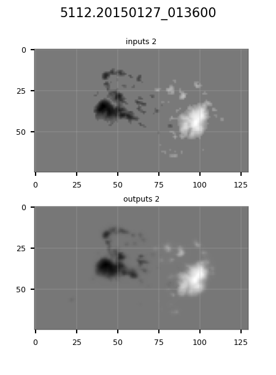
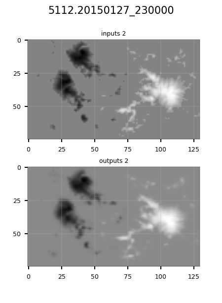
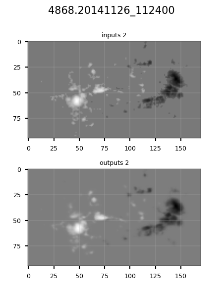
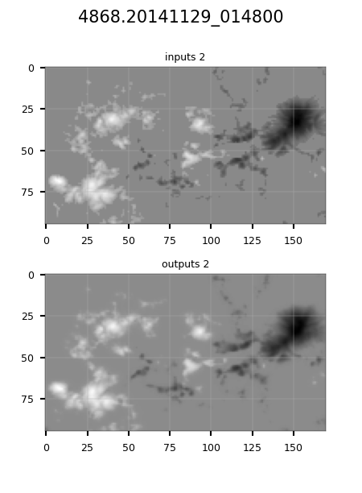
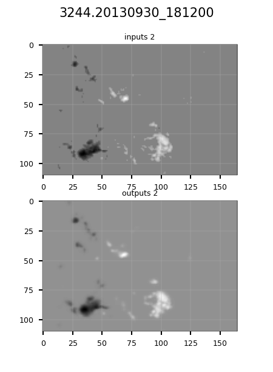
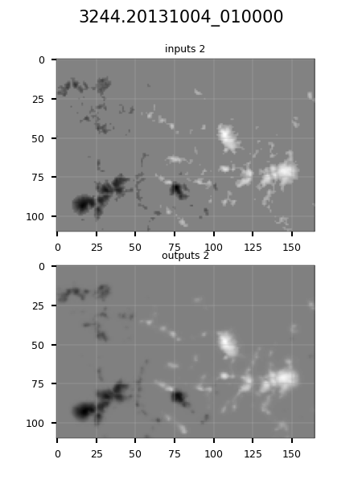

## Several groups of predicted results are shown.

In each gif, the above one is the real observed magnetic field image, and the bottom one is the magnetic field image outputted by our model. It should be noted that the 2nd to 12th frames in the bottom are the result of model fitting, and Frames 13 to 18 are completely the predicted results by model. The abscissa and ordinate units of each image are angular seconds.

### Active Region 5112

### Active Region 4868

### Active Region 3244

